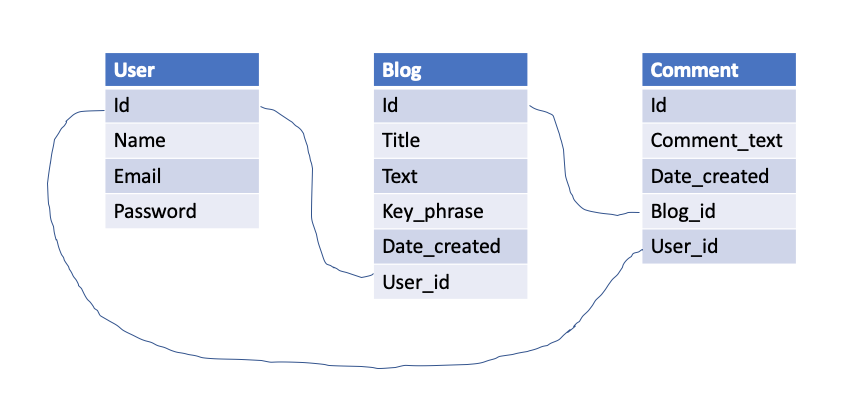

## Tech Blog - Week 14 Homework

## Description

When one thinks of a web developer, they often think of creating new applications and many thankless hours debugging codebases, but developers also spend a lot of time reading and writing about various technologies. Google can be an extremely powerful resource for tidbits of knowledge as well as tutorials to help developers of all skill-levels.

My task was to build, from scratch, a CMS-style blog similar to a Wordpress site. The application was intended to allow developers to publish blog posts as well as comment on other posts. The site was to follow the MVC paradigm, use Handlebars.js, use sequelize as the ORM, use express-session for authentication, and be deployed on Heroku.

## Table of Contents

- [User Story](#user-story)
- [Acceptance Criteria](#acceptance-criteria)
- [Database and Models](#database-and-models)
- [Views](#views)
- [Controllers](#controllers)
- [Access](#access)
- [Front End](#front-end)
- [Screen Recording](#screen-recording)
- [License](#license)
- [Link](#link)

## User Story

```md
AS A developer who writes about tech
I WANT a CMS-style blog site
SO THAT I can publish articles, blog posts, and my thoughts and opinions
```

## Acceptance Criteria

```md
GIVEN a CMS-style blog site
WHEN I visit the site for the first time
THEN I am presented with the homepage, which includes existing blog posts if any have been posted; navigation links for the homepage and the dashboard; and the option to log in
WHEN I click on the homepage option
THEN I am taken to the homepage
WHEN I click on any other links in the navigation
THEN I am prompted to either sign up or sign in
WHEN I choose to sign up
THEN I am prompted to create a username and password
WHEN I click on the sign-up button
THEN my user credentials are saved and I am logged into the site
WHEN I revisit the site at a later time and choose to sign in
THEN I am prompted to enter my username and password
WHEN I am signed in to the site
THEN I see navigation links for the homepage, the dashboard, and the option to log out
WHEN I click on the homepage option in the navigation
THEN I am taken to the homepage and presented with existing blog posts that include the post title and the date created
WHEN I click on an existing blog post
THEN I am presented with the post title, contents, post creator’s username, and date created for that post and have the option to leave a comment
WHEN I enter a comment and click on the submit button while signed in
THEN the comment is saved and the post is updated to display the comment, the comment creator’s username, and the date created
WHEN I click on the dashboard option in the navigation
THEN I am taken to the dashboard and presented with any blog posts I have already created and the option to add a new blog post
WHEN I click on the button to add a new blog post
THEN I am prompted to enter both a title and contents for my blog post
WHEN I click on the button to create a new blog post
THEN the title and contents of my post are saved and I am taken back to an updated dashboard with my new blog post
WHEN I click on one of my existing posts in the dashboard
THEN I am able to delete or update my post and taken back to an updated dashboard
WHEN I click on the logout option in the navigation
THEN I am signed out of the site
WHEN I am idle on the site for more than a set time
THEN I am able to view comments but I am prompted to log in again before I can add, update, or delete comments
```

## Database and Models

To start the application, I created a mysql database called "user_db" via schema.sql. I determined the need for 3 models - User, Comment, and Blog. See the following schema for the models and connecting foreign keys:



Once the models were initialized, I created seed JSON files for each of the models to add some preliminary data to assist with development.

## Views

After determining the models required and seeding the user_db database, I drew out all of the different required front-end views. I decided to create Handlebars.js files for 8 different views:

- Homepage
- Dashboard
- Logging In or Signing Up
- Logging Out
- Creating New Posts
- Updating Posts
- Adding & Viewing Comments
- Deleting Comments

I worked with an index.html file to create each of the different views with the necessary CSS styling, through the style.css file in the public folder, before placing the html in each of their handlebars files. I added in placeholders for the data that would be gathered through get requests.

## Controllers

To create the backend routes, I created a controller folder with a homeRoutes.js file and then an api folder that houses the userRoutes and blogRoutes. I determined the need for several different routes to handle GET, POST, PUT, and DELETE requests through the front-end javascript fetch calls. Below outlines the location of each route:

Home Routes

- GET - "/" - Homepage
- GET - "/dashboard" - Dashboard
- GET "/:id" - Individual Blog by ID
- GET "update/:id" - Update Form by Individual Blog by ID

API - User Routes

- GET - "api/users/login" - Login/Signup Page
- POST - "api/users/" - Create a User on Signup Page
- POST - "api/users/login" - Login an Individual
- GET - "api/users/logout" - Logout Page
- POST - "api/users/logout" - Destory the Session

API - Blog Routes

- GET - "api/blog/newpost" - Create New Post Form
- POST - "api/blog/newpost" - Create the New Post with Form Info
- PUT - "api/blog/:id" - Update the Individual Blog by ID
- DELETE - "api/blog/:id" - Delete the Individual Blog by ID
- POST - "api/blog/comment" - Add the Comment to the Post
- GET - "api/blog/deleteComment/:id" - View the Individual Comment by ID
- DELETE - "api/blog/comment/:id" - Delete the Individual Comment by ID

## Access

The user is limited to certain portions of the webpage without logging in/signing up. Below are the differences in access:

Without Authentication

- View Homepage
- View Individual Post with Comments
- View Login/Signup Page

With Authentication

- View Homepage
- View Individual Post with Comments
- View Login/Signup Page
- Add Comments
- Delete Comments
- View Dashboard
- Create New Posts
- Update Posts
- Delete Posts
- Logout

## Front End

All of the front end styling and javscript lives in the public folder. The javacscript folder holds functions to handle fetch requests for each of the POST, PUT, and DELETE routes. The functions are tied to the handlebars views files through event listeners on buttons or blog posts.

## Screen Recording


## License

[](https://opensource.org/licenses/MIT)

This project is protected under the MIT License.

## Link

See the following for a link to deployed Heroku application: https://tech-blog-bulger.herokuapp.com/
